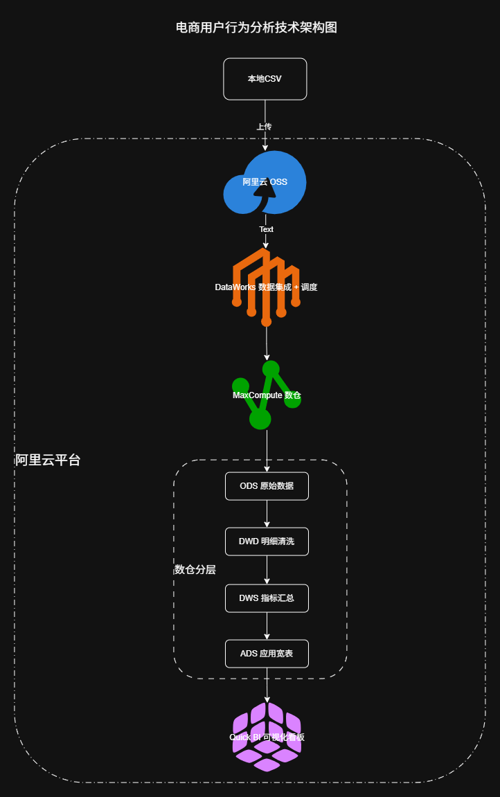
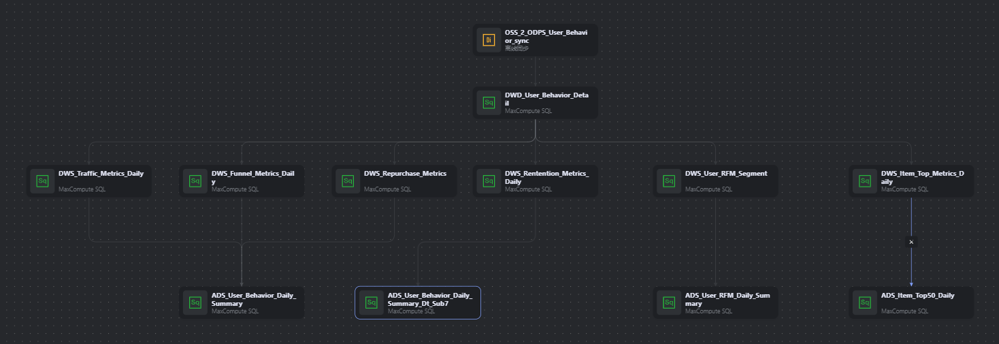
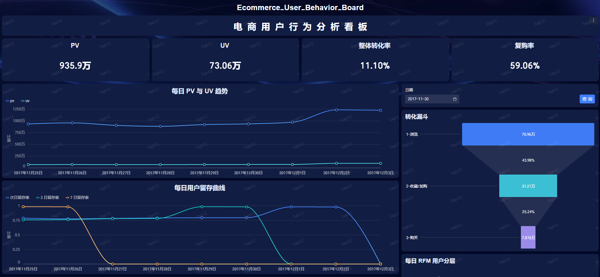
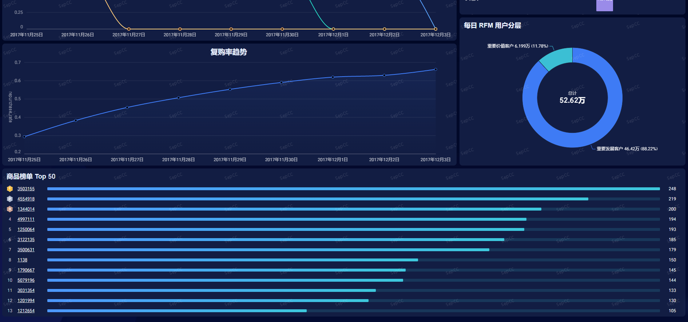

# 电商用户行为分析(基于阿里云 DataWorks + MaxCompute + Quick BI)

## 项目介绍

本项目以淘宝用户行为数据集为基础，在阿里云大数据平台上完成了从数据采集、数仓分层建模、指标计算到可视化分析的完整流程。
项目模拟真实生产环境，采用 **ODS → DWD → DWS → ADS** 四层数仓架构，覆盖流量、转化漏斗、留存、复购、RFM 用户分层和商品分析等核心业务指标，并通过 **DataWorks** 实现每日自动化调度，**Quick BI** 输出管理看板。

## 项目背景与目标

- **背景**：电商平台每天产生海量用户行为数据，需要高效、稳定地加工成业务指标，支撑运营决策。

- **目标**：
  - 搭建一套云端数据分析流程，掌握阿里云大数据产品(DataWorks、MaxCompute、Quick BI)的实际应用。
  - 完成电商核心指标的计算与可视化，验证数仓分层设计的合理性。
  - 实现调度自动化与数据质量监控，贴近生产实践。

## 技术架构



```MERMAID
graph TD
A[本地CSV] --上传--> B[阿里云OSS]
B --DataWorks数据集成--> C[MaxCompute ODS]
C --清洗--> D[DWD明细]
D --> E1[DWS流量]
D --> E2[DWS漏斗]
D --> E3[DWS留存/复购/RFM]
E1 --> F[ADS宽表]
E2 --> F
E3 --> F
F --> G[Quick BI看板]
```

### 数据流转

```TEXT
本地抽样数据 → OSS → DataWorks数据集成 → MaxCompute ODS → DWD清洗 → DWS汇总 → ADS宽表 → Quick BI看板
```

### 使用组件

- 阿里云 OSS：存储原始 CSV 文件
- DataWorks：数据集成、调度、数据质量监控
- MaxCompute：分布式 SQL 计算引擎
- Quick BI：可视化报表

## 数据源

- **来源**：阿里天池公开数据集 UserBehavior(淘宝用户行为)
- **官方下载地址**：https://tianchi.aliyun.com/dataset/649
- **字段**：**user_id** , **item_id** , **category_id** , **behavior_type** , **timestamp**
- **行为类型**：**pv(浏览)** , **buy(购买)** , **cart(加购)** , **fav(收藏)**
- **数据规模**：原始约 1 亿条(可以根据自身情况进行数据抽样，用于演示)

## 数仓分层设计

| 层级 | 表名 | 说明 |
| :-- | :-- | :-- |
| ODS | ods_user_behavior | 原始行为数据，全量接入 |
| DWD | dwd_user_behavior_detail | 清洗后明细，解析日期、小时，按日分区 |
| DWS | dws_traffic_metrics_daily | 每日流量指标(PV/UV/访问深度/跳出率) |
| DWS | dws_funnel_metrics_daily | 每日转化漏斗(浏览→收藏/加购→购买) |
| DWS | dws_retention_metrics_daily | 每日留存(1/3/7日) |
| DWS | dws_repurchase_metrics | 滚动30天复购率 |
| DWS | dws_user_rfm_segment | 用户RFM分层快照 |
| DWS | dws_item_top_metrics_daily | 每日热销商品榜 |
| ADS | ads_user_behavior_daily_summary | 核心指标宽表(合并流量/漏斗/留存/复购) |
| ADS | ads_user_rfm_daily_summary | 每日各分层用户数汇总 |
| ADS | ads_item_top50_daily | 热销商品Top50应用表 |

## 核心指标口径

详细定义请见 [核心指标口径文档](Docs/metrics_definition.md)

- **PV**：行为类型 pv 的记录数
- **UV**：任意行为的去重用户数
- **跳出率**：仅发生 1 次 pv 的用户数 / 有 pv 行为的用户数(近似口径，因无会话ID)
- **转化漏斗**：基于同一批用户，浏览 → 收藏/加购 → 购买，逐步计算 UV 转化率
- **留存率**：基准日活跃用户中，第 n 天仍活跃的用户占比(不需要连续活跃)
- **复购率**：最近 30 天内购买次数 ≥ 2 的用户 / 有购买行为的用户
- **RFM 分层**：R = 最近购买距今天数，F = 累计购买次数；分四个层级：重要价值客户、重要发展客户、重要保持客户、一般客户

## 调度配置

在 DataWorks 中配置每日调用，核心节点依赖关系如下：

```TEXT
ods_sync → dwd_detail → dws_traffic / dws_funnel / dws_repurchase / dws_rfm / dws_item_top → ads_summary / ads_rfm / ads_item_top50
```

- **流量、漏斗、复购、RFM、商品节点**：参数 dt = [yyyy-MM-dd-1]，即计算 T-1 日数据。
- **留存节点**：参数 dt_sub_7 = $[yyyy-MM-dd-7]，延迟 7 天计算，确保未来数据就绪。
- **ADS 汇总节点**：参数 dt = $[yyyy-MM-dd-1]，不依赖留存节点；留存字段后续通过补数任务回填。



## 数据质量

在 DataWorks 数据质量模块配置了一下规则：

- 核心指标(PV/UV)环比波动率不超过 50%
- 关键字段空值率为 0
- 表数据量不为 0  
  告警方式：邮件/短信(配置接收人)

## 可视化看板

Quick BI 仪表板截图(放置于 dashboard/ 目录)：

- 每日 PV/UV 趋势
- 转化漏斗
- 留存曲线
- 复购率趋势
- RFM 分层占比
- 热销商品 TOP 榜

示例截图：




## 成本说明

[详见](Docs/cost.md)

- 数据存储：OSS 20GB，新用户 90 天体验版，约 0.3 元
- MaxCompute：1 亿行数据处理约 1-3 元(一次性)
- DataWorks 按量付费：约 3-4 元
- Quick BI 个人版：免费
- **总计**：50 元以内(注意按量付费，资源用完释放)

## 目录结构

```TEXT
TB_UserBehavior_Analysis/
├── README.md
├── .gitignore
├── .gitattributes
├── Dashboard/
│   ├── overview_1.png
│   └── overview_2.png
├── DataWorks/
│   └── workflow.png
├── Dataset/
│   ├── README.md
│   ├── sample_user_behavior.csv
│   ├── Data_Exploration/
│   │   └── data_exploration.ipynb
│   └── Data_Generator/
│       └── sample_data.py
├── Docs/
|   ├── cost.md
│   └── metrics_definition.md
├── Images/
│   └── architecture.png
├── SQL/
│   ├── ODS/
│   │   └── ods_user_behavior.sql
│   ├── DW/
│   │   ├── DWD/
│   │   │   └── dwd_user_behavior_detail.sql
│   │   └── DWS/
│   │       ├── dws_traffic_metrics_daily.sql
│   │       ├── dws_funnel_metrics_daily.sql
│   │       ├── dws_retention_metrics_daily.sql
│   │       ├── dws_repurchase_metrics.sql
│   │       ├── dws_user_rfm_segment.sql
│   │       └── dws_item_top_metrics_daily.sql
│   └── ADS/
│       ├── ads_user_behavior_daily_summary.sql
│       ├── ads_user_rfm_daily_summary.sql
│       └── ads_item_top50_daily.sql
└── Language_Advancement/
    └── SQL_Advancement_GROUPING_SETS.md
```
